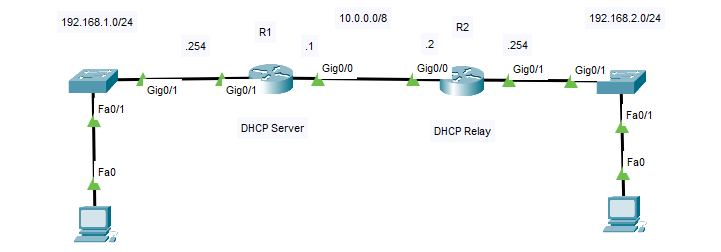

## I. Routing

```
R1(config)#ip route 192.168.2.0 255.255.255.0 10.0.0.2
R2(config)#ip route 192.168.1.0 255.255.255.0 10.0.0.1
```

## II. DHCP Server

| Syntax | Function |
|:---|:---|
| R1(config)#**ip dhcp pool** < name > | Khai báo tên pool |
| R1(dhcp-config)#**network** < net-id > < subnet-mask > | Khai báo network sẽ cấp địa chỉ IP |
| R1(dhcp-config)#**default-router** < ip-address > | Default gateway của các client |
| R1(config)#**ip dhcp excluded-address** < ip-address > < ip-address > | Địa chỉ IP loại trừ không cấp |
| R1(config)#**service dhcp** | Mở dịch vụ DHCP |

* **R1**

```
R1(config)#ip dhcp pool 1
R1(dhcp-config)#network 192.168.1.0 255.255.255.0
R1(dhcp-config)#default-router 192.168.1.254
R1(dhcp-config)#exit
R1(config)#ip dhcp excluded-address 192.168.1.1 192.168.1.10
R1(config)#service dhcp 
```

## III. DHCP Relay

* **R1**

```
R1(config)#ip dhcp pool 2
R1(dhcp-config)#network 192.168.2.0 255.255.255.0
R1(dhcp-config)#default-router 192.168.2.254
```

* **R2**

```
R2(config)#int g0/1
R2(config-if)#ip helper-address 10.0.0.1
```
