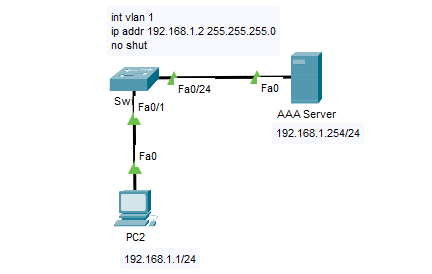
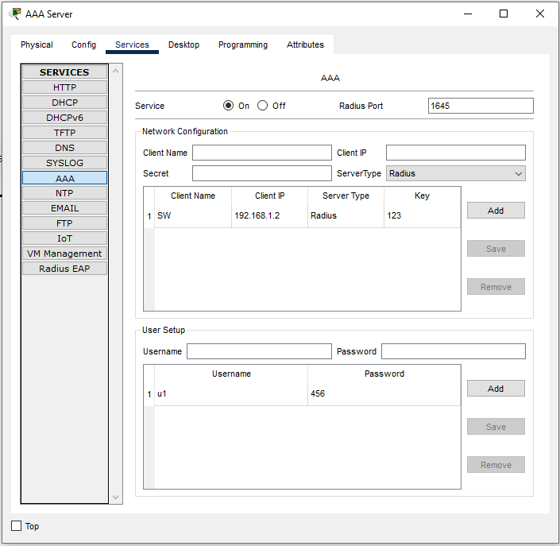

__AAA__ (**A**uthentication, **A**uthorization, and **A**ccouting) là phương thức cấu hình dùng để xác thực, cấp quyền và ghi thông tin người dùng khi sử dụng thiết bị và dịch vụ trên thiết bị Cisco. 

__Authentication__: xác định người dùng nào được phép kết nối vào thiết bị, tài khoản người dùng có thể tạo local trên thiết bị hoặc trên server dùng giao thức TACACS+ hoặc RADIUS để hỗ trợ chứng thực.

__Authorization__: xác định quyền hạn, cấu hình authorization sẽ cung cấp mức quyền hạn và các lệnh được dùng tương ứng.

__Accouting__: thu thập thông tin người dùng như địa chỉ IP, thời gian kết nối,..





```
Switch(config)#aaa new-model 
Switch(config)#radius-server host 192.168.1.254 key 123
Switch(config)#aaa authentication login ABC group radius 

Switch(config)#line vty 0 4
Switch(config-line)#login authentication ABC

Switch(config)#enable secret 789
```
