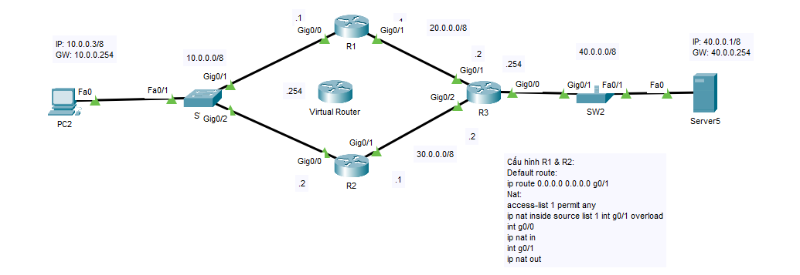

## HSRP

__Hot Standby Router Protocol (HSRP)__ cung cấp tính năng dự phòng cho router. Nếu một router gặp sự cố thay vì cấu hình chuyển đổi router cho máy tính người dùng bằng tay, giao thức này sẽ tự động hoá cho hệ thống



* __R1__

```
R1(config)#int g0/0
R1(config-if)#standby 1 ip 10.0.0.254
R1(config-if)#standby 1 priority 120
R1(config-if)#standby 1 preempt 
```

* __R2__

```
R2(config)#int g0/0
R2(config-if)#standby 1 ip 10.0.0.254
```

## GLBP

__Gateway Load Balancing Protocol (GLBP)__ là một giao thức độc quyền của Cisco cố gắng khắc phục những hạn chế của các giao thức bộ định tuyến dự phòng hiện có bằng cách thêm chức năng cân bằng tải cơ bản .

* __R1__

```
R1(config)#int g0/0
R1(config-if)#glbp 1 ip 10.0.0.254
R1(config-if)#glbp 1 priority 120
R1(config-if)#glbp 1 preempt 
```

* __R2__

```
R2(config)#int g0/0
R2(config-if)#glbp 1 ip 10.0.0.254
```
