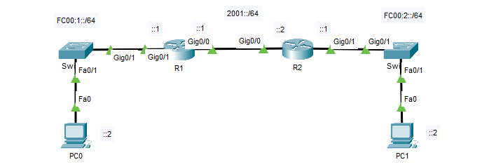

## Giới thiệu

## IPv6 Routing



### IPv6 Static Route

```
R1(config)#ipv6 unicast-routing 
R1(config)#ipv6 route FC00:2::/64 2001::2

R2(config)#ipv6 unicast-routing 
R2(config)#ipv6 route FC00:1::/64 2001::1
```

### IPv6 OSPF Route

* __R1__

```
R1(config)#ipv6 unicast-routing 
R1(config)#ipv6 router ospf 1
R1(config-rtr)#router-id 1.1.1.1

R1(config)#int g0/0
R1(config-if)#ipv6 ospf 1 area 0
R1(config-if)#int g0/1
R1(config-if)#ipv6 ospf 1 area 0
```

* __R1__

```
R2(config)#ipv6 unicast-routing 
R2(config)#ipv6 router ospf 1
R2(config-rtr)#router-id 2.2.2.2

R2(config)#int g0/0
R2(config-if)#ipv6 ospf 1 area 0
R2(config-if)#int g0/1
R2(config-if)#ipv6 ospf 1 area 0
```
