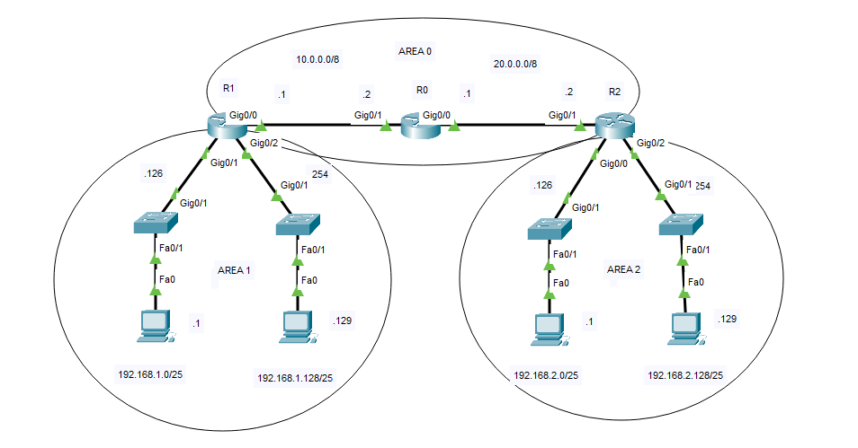

## Config

* **R0**

```
R0(config)#router ospf 1
R0(config-router)#network 10.0.0.2 0.0.0.0 area 0
R0(config-router)#network 20.0.0.1 0.0.0.0 area 0
```

* **R1**

```
R1(config)#router ospf 1
R1(config-router)#network 10.0.0.1 0.0.0.0 area 0
R1(config-router)#network 192.168.1.126 0.0.0.0 area 1
R1(config-router)#network 192.168.1.254 0.0.0.0 area 1
```

* **R2**

```
R2(config)#router ospf 1
R2(config-router)#network 20.0.0.2 0.0.0.0 area 0
R2(config-router)#network 192.168.2.126 0.0.0.0 area 2
R2(config-router)#network 192.168.2.254 0.0.0.0 area 2
```

## Summary

```
R2(config)#router ospf 1
R2(config-router)#area 2 range 192.168.2.0 255.255.255.0
```
