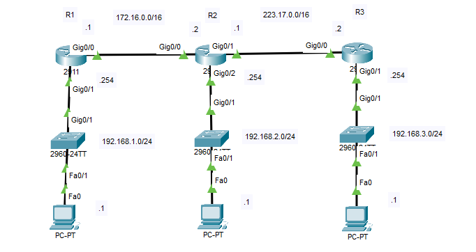
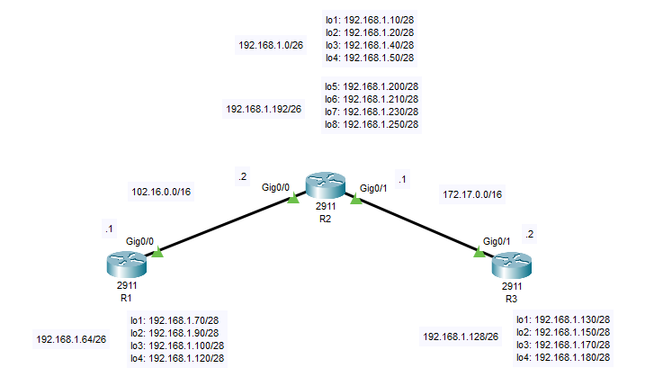
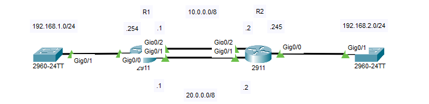
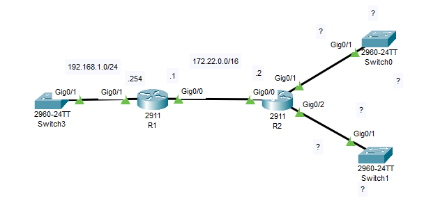

Định tuyến là thiết lập đường đi cho các gói tin dữ liệu đến được mạng đích. Mỗi router sử dụng một bảng định tuyến để thực hiện công việc này, khi định tuyến tĩnh việc thiết lập bảng định tuyến sẽ làm thủ công.



## I. Static route

| Syntax |
|:---|
| R(config)#**ip route** < ip-network > < subnet-mask > < nexthop/interface > < metric > |

**Bước 1:** cấu hình các interfaces

* **R1**

```
R1>enable
R1#configure terminal
R1(config)#interface GigabitEthernet0/0
R1(config-if)#ip address 172.16.0.1 255.255.0.0
R1(config-if)#no shutdown
R1(config-if)#exit
R1(config)#interface GigabitEthernet0/1
R1(config-if)#ip address 192.168.1.254 255.255.255.0
R1(config-if)#no shutdown
```

* **R2**

```
R2>enable
R2#configure terminal
R2(config)#interface GigabitEthernet0/0
R2(config-if)#ip address 172.16.0.2 255.255.0.0
R2(config-if)#no shutdown
R2(config-if)#exit
R2(config)#interface GigabitEthernet0/1
R2(config-if)#ip address 223.17.0.1 255.255.0.0
R2(config-if)#no shutdown
R2(config-if)#exit
R2(config)#interface GigabitEthernet0/2
R2(config-if)#ip address 192.168.2.254 255.255.255.0
R2(config-if)#no shutdown
```

* **R3**

```
R3>enable
R3#configure terminal
R3(config)#interface GigabitEthernet0/0
R3(config-if)#ip address 223.17.0.2 255.255.0.0
R3(config-if)#no shutdown
R3(config-if)#exit
R3(config)#interface GigabitEthernet0/1
R3(config-if)#ip address 192.168.3.254 255.255.255.0
R3(config-if)#no shutdown
```

**Bước 2:** Cấu hình static route

* **R1**

```
R1(config)#ip route 192.168.2.0 255.255.255.0 172.16.0.2
R1(config)#ip route 192.168.3.0 255.255.255.0 172.16.0.2
```

* **R2**

```
R2(config)#ip route 192.168.1.0 255.255.255.0 172.16.0.1
R2(config)#ip route 192.168.3.0 255.255.255.0 223.17.0.2
```

* **R3**

```
R3(config)#ip route 192.168.1.0 255.255.255.0 223.17.0.1
R3(config)#ip route 192.168.2.0 255.255.255.0 223.17.0.1
```


## II. Summary và static route



* **R1**

```
R1(config)#ip route 192.168.1.0 255.255.255.192 102.16.0.2
R1(config)#ip route 192.168.1.192 255.255.255.192 102.16.0.2
R1(config)#ip route 192.168.1.128 255.255.255.192 102.16.0.2
R1(config)#ip route 172.17.0.0 255.255.0.0 102.16.0.2
```

* **R2**

```
R2(config)#ip route 192.168.1.64 255.255.255.192 102.16.0.1
R2(config)#ip route 192.168.1.128 255.255.255.192 172.17.0.2
```

* **R3**

```
R3(config)#ip route 192.168.1.0 255.255.255.192 172.17.0.1
R3(config)#ip route 192.168.1.64 255.255.255.192 172.17.0.1
R3(config)#ip route 192.168.1.192 255.255.255.192 172.17.0.1
R3(config)#ip route 102.16.0.0 255.255.0.0 172.17.0.1
```

## III. Metric và static route



* **R1**

```
R1(config)#ip route 192.168.2.0 255.255.255.0 10.0.0.2
R1(config)#ip route 192.168.2.0 255.255.255.0 20.0.0.2 10
```

* **R2**

```
R2(config)#ip route 192.168.1.0 255.255.255.0 10.0.0.1
R2(config)#ip route 192.168.1.0 255.255.255.0 20.0.0.1 10
```

## IV. Default route



* **R2**

```
R2(config)#ip route 192.168.1.0 255.255.255.0 172.22.0.1
```

* **R1**

```
R1(config)#ip route 0.0.0.0 0.0.0.0 172.22.0.2
```
