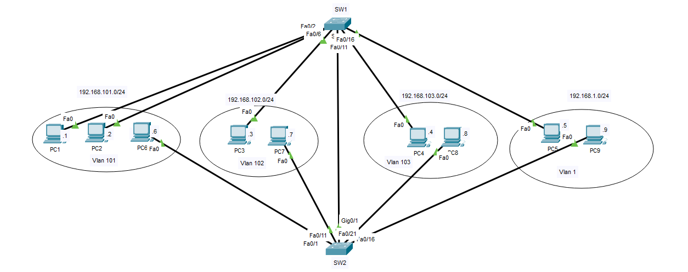
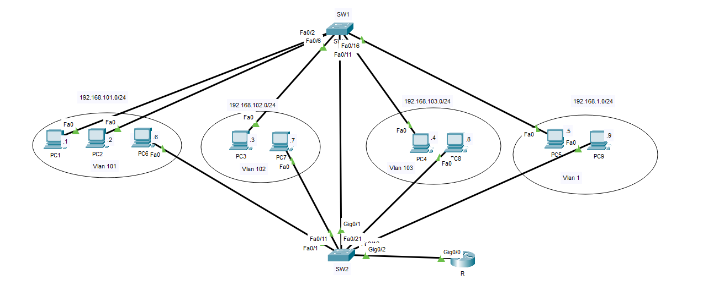
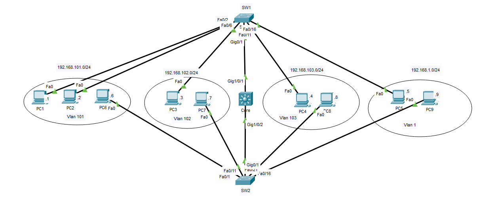

## Chia vlan

### Bước 1: Tạo Vlan

* __R1__

```
int g0/1
switchport mode trunk
```

```
vlan 101
name Hanhchanh
vlan 102
name Kinhdoanh
vlan 103
name Ketoan
exit

vtp mode server
vtp domain ABC
vtp pass 123
```

* __R2__

```
vtp mode client
vtp domain ABC
vtp pass 123
```

### Bước 2: Đưa port vào Vlan

```
int range f0/1-2
switchport mode access 
switchport access vlan 101

... (tương tự cho đưa port vào vlan phù hợp)
```

## Inter Vlan

### Cách 1: Sub interface



* __Router__

```
int g0/0
no shut
ip address 192.168.1.254 255.255.255.0

int g0/0.1
encapsulation dot1Q 101
ip address 192.168.101.254 255.255.255.0
int g0/0.2
encapsulation dot1Q 102
ip address 192.168.102.254 255.255.255.0
int g0/0.3
encapsulation dot1Q 103
ip address 192.168.103.254 255.255.255.0
```

### Cách 2: SW Layer 3



* __Core__

```
conf t
ip routing
int vlan 1
no shut
ip add 192.168.1.254 255.255.255.0
int vlan 101
ip add 192.168.101.254 255.255.255.0
int vlan 102
ip add 192.168.102.254 255.255.255.0
int vlan 103
ip add 192.168.103.254 255.255.255.0
```
