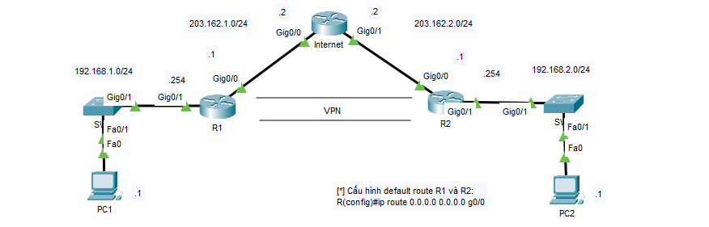

## GRE Tunnel

* __R1__

```
int tunnel 1
ip address 10.0.0.1 255.0.0.0
tunnel source g0/0
tunnel destination 203.162.2.1
tunnel mode gre ip
exit

ip route 192.168.2.0 255.255.255.0 10.0.0.2
```

* __R2__

```
int tunnel 1
ip address 10.0.0.2 255.0.0.0
tunnel source g0/0
tunnel destination 203.162.1.1
tunnel mode gre ip
exit

ip route 192.168.1.0 255.255.255.0 10.0.0.1
```

## IPSEC VPN Site-to-Site

* __R1__

```
crypto isakmp policy 9
hash md5
authentication pre-share
group 5
crypto isakmp key 123 address 203.162.2.1
crypto ipsec security-association lifetime seconds 86400

access-list 100 permit ip 192.168.1.0 0.0.0.255 192.168.2.0 0.0.0.255
crypto ipsec transform-set TS esp-3des esp-md5-hmac

crypto map CMAP 10 ipsec-isakmp
set peer 203.162.2.1
set transform-set TS
match address 100

int g0/0
crypto map CMAP
```

* __R2__

```
crypto isakmp policy 9
hash md5
authentication pre-share
group 5
crypto isakmp key 123 address 203.162.1.1
crypto ipsec security-association lifetime seconds 86400

access-list 100 permit ip 192.168.2.0 0.0.0.255 192.168.1.0 0.0.0.255
crypto ipsec transform-set TS esp-3des esp-md5-hmac

crypto map CMAP 10 ipsec-isakmp
set peer 203.162.1.1
set transform-set TS
match address 100

int g0/0
crypto map CMAP
```
