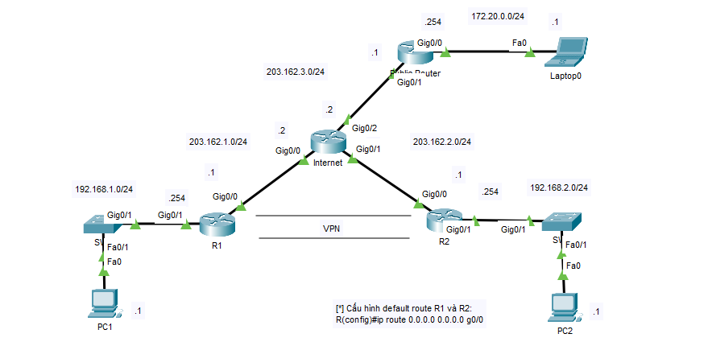

Để kết nối các chi nhánh lại với nhau hoặc để người dùng từ ngoài internet kết nối vào hệ thống nội bộ, trên router cisco hỗ trợ giải pháp VPN. Có 2 loại VPN:
* VPN Site to Site để nối 2 chi nhánh.
* VPN Client to Site để nối người dùng cá nhân vào một chi nhánh.


## GRE Tunnel

* __R1__

```
int tunnel 1
ip address 10.0.0.1 255.0.0.0
tunnel source g0/0
tunnel destination 203.162.2.1
tunnel mode gre ip
exit

ip route 192.168.2.0 255.255.255.0 10.0.0.2
```

* __R2__

```
int tunnel 1
ip address 10.0.0.2 255.0.0.0
tunnel source g0/0
tunnel destination 203.162.1.1
tunnel mode gre ip
exit

ip route 192.168.1.0 255.255.255.0 10.0.0.1
```

## IPSEC VPN Site-to-Site

* __R1__

```
crypto isakmp policy 9
hash md5
authentication pre-share
group 5
crypto isakmp key 123 address 203.162.2.1
crypto ipsec security-association lifetime seconds 86400

access-list 100 permit ip 192.168.1.0 0.0.0.255 192.168.2.0 0.0.0.255
crypto ipsec transform-set TS esp-3des esp-md5-hmac

crypto map CMAP 10 ipsec-isakmp
set peer 203.162.2.1
set transform-set TS
match address 100

int g0/0
crypto map CMAP
```

* __R2__

```
crypto isakmp policy 9
hash md5
authentication pre-share
group 5
crypto isakmp key 123 address 203.162.1.1
crypto ipsec security-association lifetime seconds 86400

access-list 100 permit ip 192.168.2.0 0.0.0.255 192.168.1.0 0.0.0.255
crypto ipsec transform-set TS esp-3des esp-md5-hmac

crypto map CMAP 10 ipsec-isakmp
set peer 203.162.1.1
set transform-set TS
match address 100

int g0/0
crypto map CMAP
```

## IPSEC VPN Client-to-Site



* __Public router__

```
ip route 0.0.0.0 0.0.0.0 G0/1
access-list 1 permit any
ip nat inside source list 1 int g0/1 overload
int g0/1
ip nat outside
int g0/0
ip nat inside
```

* __R1__

```
aaa new-model 
ip local pool VPNPOOL 192.168.1.200 192.168.1.250

crypto isakmp policy 10
authentication pre-share 
group 2
exit
crypto isakmp client configuration group CCLIENT-VPN
key KEY1 
pool VPNPOOL 
netmask 255.255.255.0
exit

crypto ipsec transform-set TS1 esp-3des esp-sha-hmac

crypto dynamic-map DMAP 10 
set transform-set TS1
reverse-route
exit
aaa authentication login VPNAUTHEN local 
username u1 password 123
aaa authorization network VPNAUTHOR local
crypto map VPNMAP client authentication list VPNAUTHEN 
crypto map VPNMAP isakmp authorization list VPNAUTHOR 
crypto map VPNMAP client configuration address respond
crypto map VPNMAP 10 ipsec-isakmp dynamic DMAP
int g0/0
crypto map VPNMAP
```
