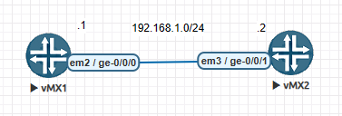

## Interface Configuration



* Ethernet

```
root@vMX1# set interfaces ge-0/0/0 unit 0 family inet address 192.168.1.1/24

root@vMX2# set interfaces ge-0/0/1 unit 0 family inet address 192.168.1.2/24
```

* Vlan tagging

```
root@vMX1# set interfaces ge-0/0/0 vlan-tagging
root@vMX1# set interfaces ge-0/0/0 unit 10 vlan-id 10
root@vMX1# set interfaces ge-0/0/0 unit 10 family inet address 192.168.1.1/24

root@vMX2# set interfaces ge-0/0/1 vlan-tagging
root@vMX2# set interfaces ge-0/0/1 unit 10 vlan-id 10
root@vMX2# set interfaces ge-0/0/1 unit 10 family inet address 192.168.1.2/24
```

* Groups

```
root@vMX1# set groups vlan_tag interfaces <ge-*> vlan-tagging
root@vMX1# set interfaces ge-0/0/0 apply-groups vlan_tag
root@vMX1# set interfaces ge-0/0/0 unit 10 vlan-id 10
root@vMX1# set interfaces ge-0/0/0 unit 10 family inet address 192.168.1.1/24

root@vMX2# set interfaces ge-0/0/1 vlan-tagging
root@vMX2# set interfaces ge-0/0/1 unit 10 vlan-id 10
root@vMX2# set interfaces ge-0/0/1 unit 10 family inet address 192.168.1.2/24
```

## More

```
# Vô hiệu hoá port
root@vMX1# deactivate interfaces ge-0/0/0
# Kích hoạt port
root@vMX1# activate interfaces ge-0/0/0

# Shutdown port
root@vMX1# set interfaces ge-0/0/0 disable
# No shutdown port
root@vMX1# delete interfaces ge-0/0/0 disable
```

```
# Một số lệnh giúp ích
root@vMX1# rename interfaces ge-0/0/0 to ge-0/0/1
root@vMX1# replace pattern ge-0/0/1 with ge-0/0/0
root@vMX1# copy interfaces ge-0/0/0 to ge-0/0/1
```
