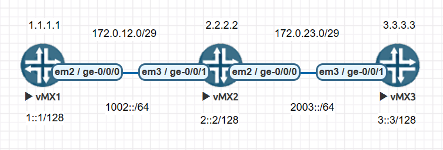

## Interface

| Syntax |
|:---|
| set interfaces `<interface-name>` unit `<unit-number>` family `inet6` address `<source>` |

```
# vMX1
set interfaces lo0 unit 0 family inet6 address 1::1/128
set interfaces ge-0/0/0 unit 0 family inet6 address 1002::1/64

# vMX2
set interfaces lo0 unit 0 family inet6 address 2::2/128
set interfaces ge-0/0/1 unit 0 family inet6 address 1002::2/64
set interfaces ge-0/0/0 unit 0 family inet6 address 2003::2/64

# vMX3
set interfaces lo0 unit 0 family inet6 address 3::3/128
set interfaces ge-0/0/1 unit 0 family inet6 address 2003::3/64
```

## Static Route

| Syntax |
|:---|
| set routing-options rib inet6.0 static route `<destination>` next-hop `<next-hop>` |

```
# vMX1
set routing-options rib inet6.0 static route 2::2/128 next-hop 1002::2
set routing-options rib inet6.0 static route 3::3/128 next-hop 1002::2

# vMX2
set routing-options rib inet6.0 static route 1::1/128 next-hop 1002::1
set routing-options rib inet6.0 static route 3::3/128 next-hop 2003::3

# vMX3
set routing-options rib inet6.0 static route 1::1/128 next-hop 2003::2
set routing-options rib inet6.0 static route 2::2/128 next-hop 2003::2
```

## OSPF Route

| Syntax |
|:---|
| set protocols `ospf3` area `<area_id>` interface `<interface_name>` |

```
# vMX1
set protocols ospf3 area 0.0.0.0 interface lo0.0
set protocols ospf3 area 0.0.0.0 interface ge-0/0/0.0

# vMX2
set protocols ospf3 area 0.0.0.0 interface lo0.0
set protocols ospf3 area 0.0.0.0 interface ge-0/0/0.0
set protocols ospf3 area 0.0.0.0 interface ge-0/0/1.0

# vMX3
set protocols ospf3 area 0.0.0.0 interface lo0.0
set protocols ospf3 area 0.0.0.0 interface ge-0/0/1.0
```