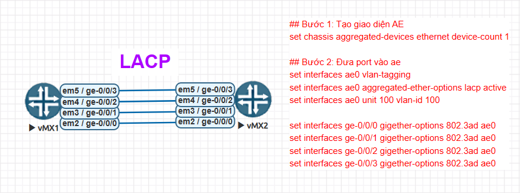

## Bước 1: Tạo giao diện Aggregated Ethernet (AE)

```
[edit]
root@vMX1# run show interfaces terse | match ae

[edit]
root@vMX1# set chassis aggregated-devices ethernet device-count 1

[edit]
root@vMX1# commit
commit complete

[edit]
root@vMX1# run show interfaces terse | match ae
ae0                     up    down

(Tương tự cho vMX2)
```

## Bước 2: Đưa port vào ae

```
# vMX1 + vMX2

set interfaces ae0 vlan-tagging
set interfaces ae0 aggregated-ether-options lacp active
set interfaces ae0 unit 0 family bridge interface-mode trunk
set interfaces ae0 unit 0 family bridge vlan-id-list 100

set interfaces ge-0/0/0 gigether-options 802.3ad ae0
set interfaces ge-0/0/1 gigether-options 802.3ad ae0
set interfaces ge-0/0/2 gigether-options 802.3ad ae0
```

## Kiểm tra

```
root@vMX1> show lacp statistics interfaces
Aggregated interface: ae0
    LACP Statistics:       LACP Rx     LACP Tx   Unknown Rx   Illegal Rx
      ge-0/0/0                 100         189            0            0
      ge-0/0/1                 100         189            0            0
      ge-0/0/2                 101         189            0            0
      ge-0/0/3                 101         189            0            0

root@vMX1> show interfaces terse | match ae
ge-0/0/0.100            up    up   aenet    --> ae0.100
ge-0/0/0.32767          up    up   aenet    --> ae0.32767
ge-0/0/1.100            up    up   aenet    --> ae0.100
ge-0/0/1.32767          up    up   aenet    --> ae0.32767
ge-0/0/2.100            up    up   aenet    --> ae0.100
ge-0/0/2.32767          up    up   aenet    --> ae0.32767
ge-0/0/3.100            up    up   aenet    --> ae0.100
ge-0/0/3.32767          up    up   aenet    --> ae0.32767
ae0                     up    up
ae0.100                 up    up   multiservice
ae0.32767               up    up   multiservice
```