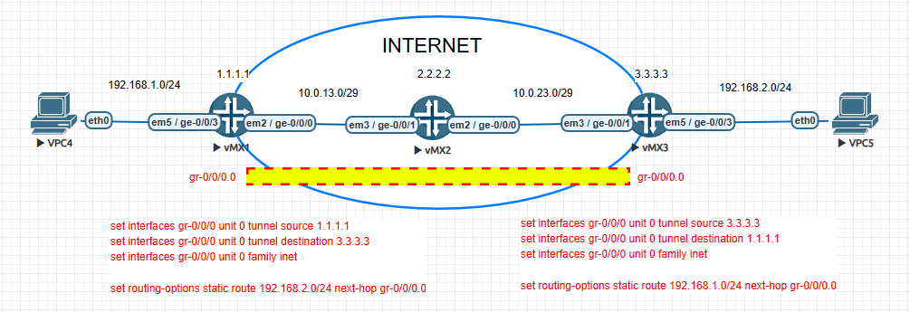

## Chuẩn bị



* Cấu hình interfaces

```
# vMX1
set interfaces ge-0/0/0 unit 0 family inet address 10.0.12.1/29
set interfaces ge-0/0/3 unit 0 family inet address 192.168.1.1/24
set interfaces lo0 unit 0 family inet address 1.1.1.1/32

# vMX2
set interfaces ge-0/0/0 unit 0 family inet address 10.0.23.2/29
set interfaces ge-0/0/1 unit 0 family inet address 10.0.12.2/29
set interfaces lo0 unit 0 family inet address 2.2.2.2/32

# vMX3
set interfaces ge-0/0/1 unit 0 family inet address 10.0.23.3/29
set interfaces ge-0/0/3 unit 0 family inet address 192.168.2.3/24
set interfaces lo0 unit 0 family inet address 3.3.3.3/32
```

* Cấu hình ospf

```
# vMX1
set protocols ospf area 0.0.0.0 interface lo0.0
set protocols ospf area 0.0.0.0 interface ge-0/0/0.0

# vMX2
set protocols ospf area 0.0.0.0 interface lo0.0
set protocols ospf area 0.0.0.0 interface ge-0/0/0.0
set protocols ospf area 0.0.0.0 interface ge-0/0/1.0

# vMX3
set protocols ospf area 0.0.0.0 interface lo0.0
set protocols ospf area 0.0.0.0 interface ge-0/0/1.0
```

## Định nghĩa giao diện Tunnel

Với MX series cần enable tunnel services

`set chassis fpc 0 pic 0 tunnel-services bandwidth 10g`

```
# vMX1

set chassis fpc 0 pic 0 tunnel-services bandwidth 10g

set interfaces gr-0/0/0 unit 0 tunnel source 1.1.1.1
set interfaces gr-0/0/0 unit 0 tunnel destination 3.3.3.3
set interfaces gr-0/0/0 unit 0 family inet

# vMX3

set chassis fpc 0 pic 0 tunnel-services bandwidth 10g

set interfaces gr-0/0/0 unit 0 tunnel source 3.3.3.3
set interfaces gr-0/0/0 unit 0 tunnel destination 1.1.1.1
set interfaces gr-0/0/0 unit 0 family inet
```

## Định nghĩa tuyến đường

```
# vMX1
set routing-options static route 192.168.2.0/24 next-hop gr-0/0/0.0

# vMX3
set routing-options static route 192.168.1.0/24 next-hop gr-0/0/0.0
```

## Kiểm tra

* Kiểm tra trạng thái interface gr

```
root@vMX1> show interfaces gr-0/0/0 terse
Interface               Admin Link Proto    Local                 Remote
gr-0/0/0                up    up
gr-0/0/0.0              up    up   inet

root@vMX3> show interfaces gr-0/0/0 terse
Interface               Admin Link Proto    Local                 Remote
gr-0/0/0                up    up
gr-0/0/0.0              up    up   inet
```

* Kiểm tra route

```
root@vMX1> show route 192.168.2.0

inet.0: 10 destinations, 10 routes (10 active, 0 holddown, 0 hidden)
+ = Active Route, - = Last Active, * = Both

192.168.2.0/24     *[Static/5] 00:07:17
                    > via gr-0/0/0.0

root@vMX3> show route 192.168.1.0

inet.0: 10 destinations, 10 routes (10 active, 0 holddown, 0 hidden)
+ = Active Route, - = Last Active, * = Both

192.168.1.0/24     *[Static/5] 00:07:25
                    > via gr-0/0/0.0
```

* Kiểm tra ping

```
VPC4> show ip

NAME        : VPC4[1]
IP/MASK     : 192.168.1.4/24
GATEWAY     : 192.168.1.1

VPC4> ping 192.168.2.5

84 bytes from 192.168.2.5 icmp_seq=1 ttl=62 time=6.518 ms
84 bytes from 192.168.2.5 icmp_seq=2 ttl=62 time=3.316 ms
84 bytes from 192.168.2.5 icmp_seq=3 ttl=62 time=3.701 ms
84 bytes from 192.168.2.5 icmp_seq=4 ttl=62 time=3.679 ms

VPC5> show ip

NAME        : VPC5[1]
IP/MASK     : 192.168.2.5/24
GATEWAY     : 192.168.2.3

VPC5> ping 192.168.1.4

84 bytes from 192.168.1.4 icmp_seq=1 ttl=62 time=4.843 ms
84 bytes from 192.168.1.4 icmp_seq=2 ttl=62 time=4.529 ms
84 bytes from 192.168.1.4 icmp_seq=4 ttl=62 time=4.247 ms
84 bytes from 192.168.1.4 icmp_seq=5 ttl=62 time=4.095 ms
```